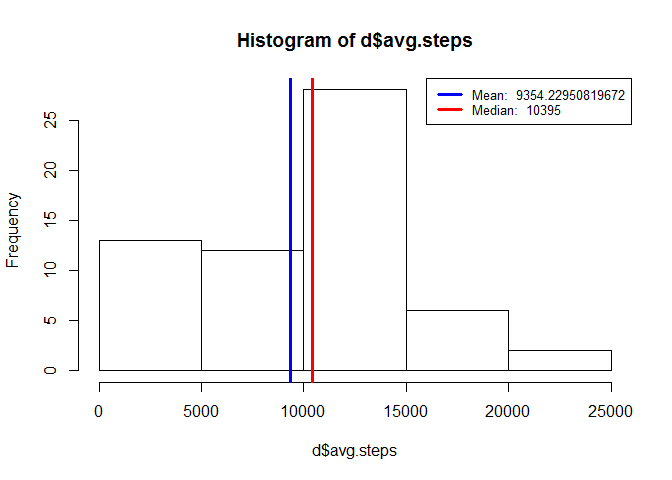
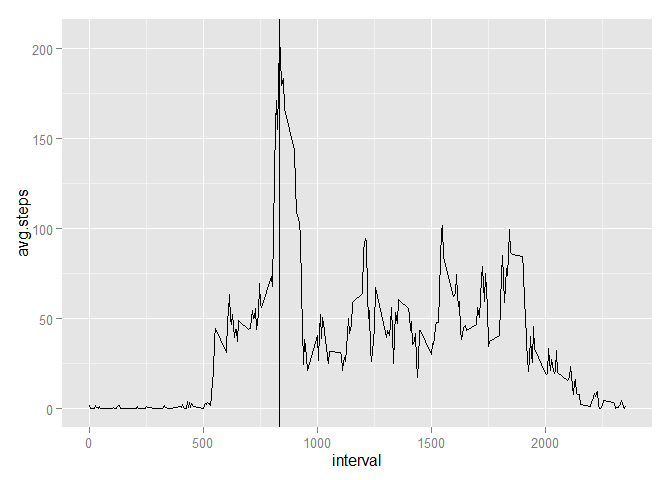
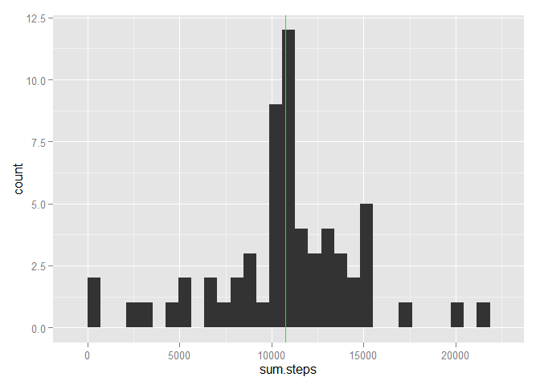
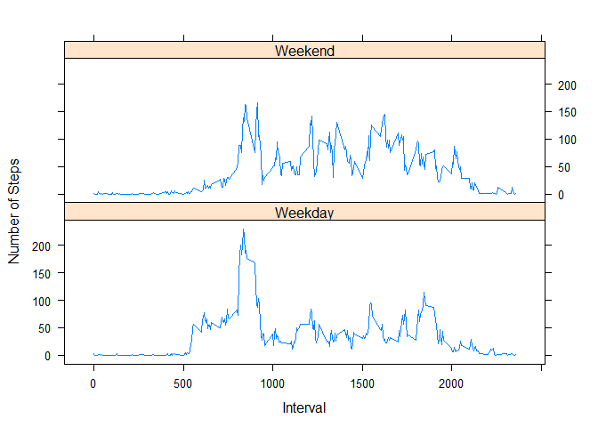

# Reproducible Research: Peer Assessment 1


## Loading and preprocessing the data

Assumption: activity.csv is in the given path.

```r
data <- read.csv("D:/src/coursera/datascience/activity.csv")
```

## What is mean total number of steps taken per day?


```r
library(plyr)
library(ggplot2)

d = ddply(data, .(date),summarize,avg.steps=sum(steps,na.rm=T))
hist(d$avg.steps)
mean_value = mean(d$avg.steps)
median_value = median(d$avg.steps)
abline(v=mean_value, lwd = 3, col = 'blue')
abline(v=median_value, lwd = 3, col = 'red')

 #create legend
 legend('topright', lty = 1, lwd = 3, col = c("blue", "red"),
        cex = .8, 
        legend = c(paste('Mean: ', mean_value),
                   paste('Median: ', median_value)))
```

 

## What is the average daily activity pattern?


```r
d = ddply(data, .(interval),summarize,avg.steps=mean(steps,na.rm=T))

max_steps = d[which.max(d$avg.steps),]


ggplot(d,aes(x=interval,y=avg.steps, group=0)) +geom_line()+ geom_vline(aes(xintercept=max_steps$interval))
```

 

The interval with max number of steps is 835 and the max steps is 206.1698113

## Inputing missing values


```r
d0 <- subset(data,is.na(data$steps))
d1 = ddply(data, .(interval),summarize,avg.steps=mean(steps,na.rm=T))

names(d1)  <- c('interval','steps')
m <- merge(d0,d1,by="interval")
m$steps.x <- NULL

d1$steps <- round(d1$steps)
m <- merge(data,d1,by="interval")
m$steps.x[is.na(m$steps.x)] <- m$steps.y[is.na(m$steps.x)]

n = ddply(m, .(date),summarize,sum.steps=sum(steps.x,na.rm=T))
ggplot(n,aes(x=sum.steps))+ geom_histogram() + geom_vline(aes(xintercept=mean(sum.steps)),color="red") +  geom_vline(aes(xintercept=median(sum.steps)),color="green")
```

```
## stat_bin: binwidth defaulted to range/30. Use 'binwidth = x' to adjust this.
```

 

Mean is 1.0765639\times 10^{4} and median is 1.0762\times 10^{4}


## Are there differences in activity patterns between weekdays and weekends?


```r
library(lattice)
m$day = weekdays(as.Date(m$date))

    weekfunction = function(x){
    if(x %in% c('Saturday', 'Sunday')){
    return('Weekend')
    }
    return('Weekday')
    }
m$daytype = as.factor(apply(as.matrix(m$day),1,weekfunction))

o = ddply(m, c('interval','daytype' ),summarize,steps=mean(steps.x,na.rm=T))

xyplot(steps~interval | daytype,data=o,type='l',xlab ='Interval',ylab='Number of Steps',layout=c(1,2))
```

 
